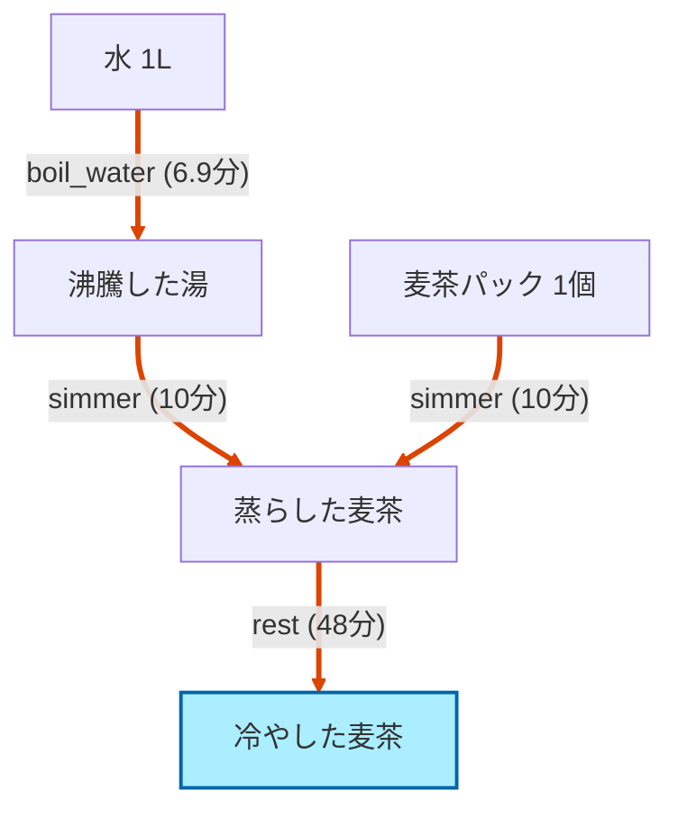

# Example 1: 麦茶 — やかんを持たないユーザー向け代替

代替提案システムが本領を発揮するケース。元レシピが「やかんで湯を沸かす」を前提にしているが、ユーザーは **やかんも冷蔵庫も持っていない**。pipeline は自動で片手鍋＋氷水急冷に置き換える。

## 入力

### レシピ (`data/recipes/mugicha.json`)

```json
{
  "id": "mugicha-home",
  "title": "麦茶",
  "servings": 4,
  "source_attribution": "家庭で作る麦茶（やかんで煮出すスタイル）",
  "ingredients_text": [
    "水 1L",
    "麦茶パック 1個"
  ],
  "steps_text": [
    "やかんに水を入れて強火にかけ、沸騰させる",
    "火を止めて麦茶パックを入れ、10分蒸らす",
    "粗熱を取り冷蔵庫で冷やす"
  ],
  "tips": "煮出した方が香ばしさが出る。氷で急冷すると濁る場合がある。"
}
```

### ユーザーの主な制約

- やかん **なし** → step 1 の容器要求が満たせない
- 冷蔵庫 **なし** → step 3 の `rest` action 要求が満たせない
- 片手鍋・両手鍋・電子レンジ・ボウル大／小 あり

## 処理

### 検出された違反

```
e_boil_water: container/やかん  ← step 1
e_steep:      container/やかん  ← step 2 (やかんを継続使用する想定)
e_cool:       appliance/冷蔵庫  ← step 3
```

### 適用された代替

| 対象 | 元 | 代替 | 影響 |
|---|---|---|---|
| step 1 | やかん | 片手鍋+コンロ | 時間 +0.9 分 |
| step 2 | やかん | 片手鍋+コンロ | 時間 ±0 分 |
| step 3 | 冷蔵庫 | 氷水で急冷 | 時間 -72 分（fridge冷却 120 分前提に対し 48 分） |

step 3 の代替は `tool_use_table.json` に新規追加した `rest` action の `氷水で急冷` option がヒットしたもの。冷蔵庫がない場合の自然な代替として **氷水ボウル** にフォールバックする。

## 出力 (Haiku 4.5、`--renderer` 付き)

### 手順

```
片手鍋に水1L を入れて強火にかけ、沸騰させます。
火を止めて麦茶パック1個を入れ、10分蒸らします。
粗熱を取り、氷水で冷やします。
```

renderer が「（代替）」注釈をクリーンアップし、分量を埋め込み、ます形で統一している。

### スケジュール (makespan 64.9 分)

```
[  0.0-  6.9] やかんに水を入れて強火にかけ、沸騰させる（片手鍋+コンロで代替） (CP)
[  6.9- 16.9] 火を止めて麦茶パックを入れ、10分蒸らす（片手鍋+コンロで代替） (CP)
[ 16.9- 64.9] 粗熱を取り冷蔵庫で冷やす（氷水で急冷で代替） (CP)
```

3 ステップとも前段の出力に依存するため完全直列。CP は全エッジを通る。

### DAG (Mermaid)



### 買い物リスト

**食材**: 水 1L、麦茶パック 1 個

**必要なもの**: コンロ口 (any burner)、ボウル、片手鍋

## 再現

```bash
# Anthropic 経路 (Haiku 4.5、API key 不要)
recipe-optimizer run --recipe data/recipes/mugicha.json --backend claude_cli --renderer

# ローカル GGUF
recipe-optimizer run --recipe data/recipes/mugicha.json --backend gguf
```

## このサンプルが示すこと

- 元レシピを書き換えずに、ユーザーの不所持リソース（やかん・冷蔵庫）を自動検出
- テーブルからの選択（boil_water → 片手鍋+コンロ）と LLM の追記による発見（rest action）の両方が機能
- renderer が DAG を家庭料理レシピ調の自然な日本語に整形
- 検証可能な audit trail（適用された代替がスケジュール上でも明示される）
