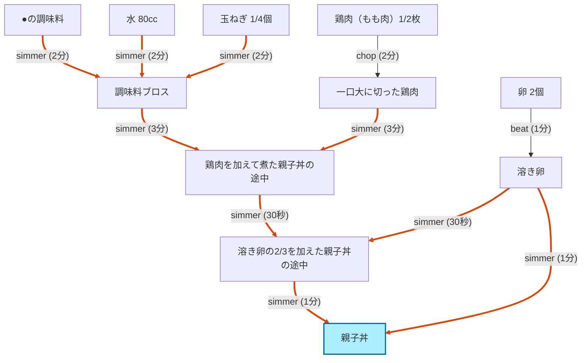

# Example 2: 親子丼 — 複雑な多段レシピの DAG 化

8 ステップの典型的な家庭料理を Haiku でパースし、並列化と CP 計算を確認するケース。デモユーザーは必要な器具を一通り揃えているため代替は発生せず、純粋にスケジューリングと出力品質の検証になる。

## 入力

### レシピ (`data/recipes/oyakodon.json`)

クックパッドの「☆親子丼☆」レシピ（出典明記）を JSON 化したもの:

```json
{
  "id": "oyakodon-cookpad-18442207",
  "title": "親子丼",
  "servings": 1,
  "source_url": "https://cookpad.com/jp/recipes/18442207-%E8%A6%AA%E5%AD%90%E4%B8%BC",
  "ingredients_text": [
    "鶏肉（もも肉） 1/2枚",
    "卵 2個",
    "玉ねぎ 1/4個",
    "●しょうゆ 大さじ1",
    "●みりん 大さじ1",
    "●酒 大さじ1/2",
    "●砂糖 大さじ1/2",
    "●顆粒和風だし 小さじ1/3",
    "●水 80cc"
  ],
  "steps_text": [
    "鍋に●の調味料と玉ねぎを入れる",
    "強めの中火で2分煮る",
    "一口大に切った鶏肉を加える",
    "中火で更に3分ほど煮て鶏肉に火を通す",
    "溶き卵の2/3を加えて菜箸で全体に混ぜ合わせる",
    "蓋をして中火で30秒",
    "残りの溶き卵も加えて中火で半熟になるまで煮る",
    "器に盛って出来上がり"
  ],
  "tips": "卵はあまり混ぜすぎない。溶き卵を入れる前に、煮汁を味見してお好みの味に調整しておく。"
}
```

### ユーザーの主な制約

- 鍋（鍋）あり、コンロ口 2 つ、ボウル類 あり
- 包丁・まな板（包丁系）あり、菜箸 あり
- 不所持: やかん・冷蔵庫など（このレシピでは関係なし）

## 処理

### 検出された違反

なし。

Haiku は 11 ノード・11 エッジの DAG を生成し、各エッジに必要なリソース（cook / burner / container）を埋めた。デモユーザーは「鍋」「ボウル」「コンロ」を持っているため checker はクリーン。

### 暗黙の prep 推論

元レシピの step 3 は「一口大に切った鶏肉を加える」だけで chop の工程は明示されていないが、Haiku は **暗黙の `chop` エッジ**（`n_chicken_raw` → `n_chicken_diced`）を補った。同様に step 5 で必要な「溶き卵」は **暗黙の `beat` エッジ**として補完。

## 出力 (Haiku 4.5、`--renderer` 付き)

### 手順

```
鶏肉1/2枚を一口大に切る
卵2個を溶く
鍋に●の調味料と玉ねぎ1/4個を入れて、強めの中火で2分煮る
一口大に切った鶏肉を加えて、中火で3分ほど煮て火を通す
溶き卵の2/3を加えて菜箸で全体に混ぜ合わせ、蓋をして中火で30秒煮る
残りの溶き卵を加えて、中火で半熟になるまで煮る
```

元レシピ8ステップを論理的に 6 ステップへ凝集（調味料 mix を `simmer` 開始へ統合、蓋する＋30秒 を 1 ステップに）。分量も自動で挿入されている。

### スケジュール (makespan 9.5 分)

```
[  0.0-  2.0] 鶏肉を一口大に切る
[  2.0-  3.0] 卵を溶く
[  3.0-  5.0] 鍋に●の調味料と玉ねぎを入れて強めの中火で2分煮る (CP)
[  5.0-  8.0] 一口大に切った鶏肉を加えて中火で3分ほど煮て鶏肉に火を通す (CP)
[  8.0-  8.5] 溶き卵の2/3を加えて菜箸で全体に混ぜ合わせ、蓋をして中火で30秒煮る (CP)
[  8.5-  9.5] 残りの溶き卵を加えて中火で半熟になるまで煮る (CP)
```

クリティカルパス: simmer の4段（合計 6.5 分）+ 前処理 3 分。chop 中の workstation と beat 中の cook が並列実行できないため、scheduler は prep 2 件を直列化している（cook プール容量 1）。

### DAG (Mermaid)



赤線がクリティカルパス。chop と beat（prep）は最初の 3 分以内で完了し、その後の simmer 連鎖（合計 6.5 分）が支配する。

### 買い物リスト

**食材**: 鶏もも肉 1/2 枚、卵 2 個、玉ねぎ 1/4 個、しょうゆ・みりん・酒・砂糖・顆粒和風だし・水（●印の調味料一式）

**必要なもの**: コンロ口 (any burner)、ボウル、鍋

## 再現

```bash
recipe-optimizer run --recipe data/recipes/oyakodon.json --backend claude_cli --renderer
```

実行時間: 2回の Haiku 呼び出し（parser + renderer）で約 40-60 秒、コスト約 $0.30-0.40。

## このサンプルが示すこと

- 8 ステップのレシピを 11 ノード・11 エッジの DAG として構造化
- 暗黙の prep 工程（chop 鶏肉、beat 卵）を Haiku が補完
- クリティカルパス計算が機能（simmer 連鎖が支配、prep は並列可能）
- 元レシピを 6 つの磨かれた手順に凝集
- 代替が発生しない happy-path でも全段クリーンに動作
- DAG が Mermaid でそのまま図として共有可能

## 観察された軽微な課題

- chop の duration: Haiku は鶏肉のカットを 2 分と推定。手作り fixture（`tests/fixtures/oyakodon_dag.py`）も 2 分なので問題なし。一部の単発 probe では 5 分と過大評価することがあった（モデルのばらつき範囲内）
- 調味料を1個1個 mix ノードにする派と統合する派が run ごとに揺れる場合がある（few-shot の追加余地）
