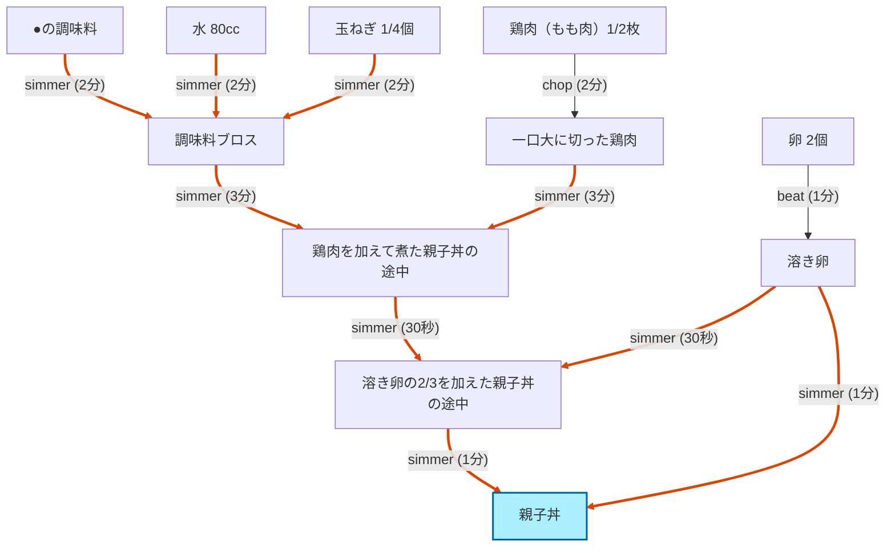

# Example 2: 親子丼 — 複雑な多段レシピの DAG 化

8 ステップの典型的な家庭料理を Haiku でパースし、並列化と CP 計算を確認するケース。デモユーザーは必要な器具を一通り揃えているため代替は発生せず、純粋にスケジューリングと出力品質の検証になる。

## 入力

### レシピ (`data/recipes/oyakodon.json`)

クックパッドの「☆親子丼☆」レシピ（出典明記）を JSON 化したもの:

```json
{
  "id": "oyakodon-cookpad-18442207",
  "title": "親子丼",
  "servings": 1,
  "source_url": "https://cookpad.com/jp/recipes/18442207-%E8%A6%AA%E5%AD%90%E4%B8%BC",
  "ingredients_text": [
    "鶏肉（もも肉） 1/2枚",
    "卵 2個",
    "玉ねぎ 1/4個",
    "●しょうゆ 大さじ1",
    "●みりん 大さじ1",
    "●酒 大さじ1/2",
    "●砂糖 大さじ1/2",
    "●顆粒和風だし 小さじ1/3",
    "●水 80cc"
  ],
  "steps_text": [
    "鍋に●の調味料と玉ねぎを入れる",
    "強めの中火で2分煮る",
    "一口大に切った鶏肉を加える",
    "中火で更に3分ほど煮て鶏肉に火を通す",
    "溶き卵の2/3を加えて菜箸で全体に混ぜ合わせる",
    "蓋をして中火で30秒",
    "残りの溶き卵も加えて中火で半熟になるまで煮る",
    "器に盛って出来上がり"
  ],
  "tips": "卵はあまり混ぜすぎない。溶き卵を入れる前に、煮汁を味見してお好みの味に調整しておく。"
}
```

### ユーザーの主な制約

- 鍋（鍋）あり、コンロ口 2 つ、ボウル類 あり
- 包丁・まな板（包丁系）あり、菜箸 あり
- 不所持: やかん・冷蔵庫など（このレシピでは関係なし）

## 処理

### 検出された違反

なし。

Haiku は 11 ノード・11 エッジの DAG を生成し、各エッジに必要なリソース（cook / burner / container）を埋めた。デモユーザーは「鍋」「ボウル」「コンロ」を持っているため checker はクリーン。

### 暗黙の prep 推論

元レシピの step 3 は「一口大に切った鶏肉を加える」だけで chop の工程は明示されていないが、Haiku は **暗黙の `chop` エッジ**（`n_chicken_raw` → `n_chicken_diced`）を補った。同様に step 5 で必要な「溶き卵」は **暗黙の `beat` エッジ**として補完。

## 出力 (Haiku 4.5、`--renderer` 付き)

### 手順

```
鶏肉1/2枚を一口大に切る
卵2個を溶く
鍋に●の調味料と玉ねぎ1/4個を入れて、強めの中火で2分煮る
一口大に切った鶏肉を加えて、中火で3分ほど煮て火を通す
溶き卵の2/3を加えて菜箸で全体に混ぜ合わせ、蓋をして中火で30秒煮る
残りの溶き卵を加えて、中火で半熟になるまで煮る
```

元レシピ8ステップを論理的に 6 ステップへ凝集（調味料 mix を `simmer` 開始へ統合、蓋する＋30秒 を 1 ステップに）。分量も自動で挿入されている。

### スケジュール (makespan 9.5 分)

```
[  0.0-  2.0] 鶏肉を一口大に切る
[  2.0-  3.0] 卵を溶く
[  3.0-  5.0] 鍋に●の調味料と玉ねぎを入れて強めの中火で2分煮る (CP)
[  5.0-  8.0] 一口大に切った鶏肉を加えて中火で3分ほど煮て鶏肉に火を通す (CP)
[  8.0-  8.5] 溶き卵の2/3を加えて菜箸で全体に混ぜ合わせ、蓋をして中火で30秒煮る (CP)
[  8.5-  9.5] 残りの溶き卵を加えて中火で半熟になるまで煮る (CP)
```

クリティカルパス: simmer の4段（合計 6.5 分）+ 前処理 3 分。chop 中の workstation と beat 中の cook が並列実行できないため、scheduler は prep 2 件を直列化している（cook プール容量 1）。

### DAG (Mermaid)



赤線がクリティカルパス。chop と beat（prep）は最初の 3 分以内で完了し、その後の simmer 連鎖（合計 6.5 分）が支配する。

### 裏側の構造（テーブル表現）

Mermaid 図ではノードとアクションしか見えないが、checker と scheduler が実際に読むのは以下のテーブル群。以下は `tests/fixtures/oyakodon_dag.py` のハンドクラフト版（Haiku 出力も同形だがノード名と prep の粒度が違うだけ）。`RecipeDAG` は Pydantic モデルだが、フラットなテーブルに展開するとこうなる。

#### Table A: `GoalNode`（11 → 15 行に展開）

| node_id | description | is_final |
|---|---|---|
| n_chicken_raw | 生の鶏もも肉 1/2枚 |  |
| n_onion_raw | 生の玉ねぎ 1/4個 |  |
| n_eggs_raw | 生卵 2個 |  |
| n_seasoning | 合わせ調味料 |  |
| n_chicken_cut | 一口大に切った鶏肉 |  |
| n_onion_sliced | 薄切りにした玉ねぎ |  |
| n_eggs_beaten | 溶き卵 |  |
| n_pot_step1 | 鍋に調味料と玉ねぎを入れた状態 |  |
| n_simmered_onion | 玉ねぎが煮えた状態 |  |
| n_with_chicken | 鶏肉を加えた鍋 |  |
| n_chicken_done | 鶏肉に火が通った煮汁 |  |
| n_first_egg | 溶き卵2/3を加え混ぜた状態 |  |
| n_lidded | 蓋をして30秒煮た状態 |  |
| n_almost_done | 残りの卵を加えた半熟状態 |  |
| n_done | 完成した親子丼 | ✓ |

#### Table B: `ProcessEdge`（DAG の骨格・11 行）

| edge_id | action | duration_min | from_nodes | to_node |
|---|---|---|---|---|
| e_chop_chicken | chop | 2.0 | [n_chicken_raw] | n_chicken_cut |
| e_slice_onion | slice | 2.0 | [n_onion_raw] | n_onion_sliced |
| e_beat_eggs | beat | 1.0 | [n_eggs_raw] | n_eggs_beaten |
| e_combine_step1 | mix | 0.5 | [n_seasoning, n_onion_sliced] | n_pot_step1 |
| e_simmer_onion | simmer | 2.0 | [n_pot_step1] | n_simmered_onion |
| e_add_chicken | mix | 0.3 | [n_simmered_onion, n_chicken_cut] | n_with_chicken |
| e_simmer_chicken | simmer | 3.0 | [n_with_chicken] | n_chicken_done |
| e_add_first_egg | mix | 0.3 | [n_chicken_done, n_eggs_beaten] | n_first_egg |
| e_lid | simmer | 0.5 | [n_first_egg] | n_lidded |
| e_finish_egg | simmer | 1.0 | [n_lidded] | n_almost_done |
| e_serve | serve | 0.3 | [n_almost_done] | n_done |

`from_nodes` は多値（多対多）なので、リレーショナルに正規化するには別テーブルに切り出すべき（後述）。

#### Table C: `ResourceRequirement`（Mermaid に出てこない核心・25 行）

各エッジが何のリソースを **どれだけの時間** 占有するかをすべて明示的に declare している。

| edge_id | kind | name_hint | hold_duration_min | start_offset_min | コメント |
|---|---|---|---|---|---|
| e_chop_chicken | cook | – | 2.0 | 0.0 | |
| e_chop_chicken | workstation | – | 2.0 | 0.0 | |
| e_slice_onion | cook | – | 2.0 | 0.0 | |
| e_slice_onion | workstation | – | 2.0 | 0.0 | |
| e_beat_eggs | cook | – | 1.0 | 0.0 | |
| e_beat_eggs | container | ボウル | 1.0 | 0.0 | |
| e_combine_step1 | cook | – | 0.5 | 0.0 | |
| e_combine_step1 | container | 片手鍋 | 0.5 | 0.0 | |
| e_simmer_onion | cook | – | **0.5** | 0.0 | ← 2.0 分中の最初 30 秒のみ拘束 |
| e_simmer_onion | burner | – | 2.0 | 0.0 | |
| e_simmer_onion | container | 片手鍋 | 2.0 | 0.0 | |
| e_add_chicken | cook | – | 0.3 | 0.0 | |
| e_add_chicken | container | 片手鍋 | 0.3 | 0.0 | |
| e_simmer_chicken | cook | – | **0.5** | 0.0 | ← 3.0 分中の最初 30 秒のみ拘束 |
| e_simmer_chicken | burner | – | 3.0 | 0.0 | |
| e_simmer_chicken | container | 片手鍋 | 3.0 | 0.0 | |
| e_add_first_egg | cook | – | 0.3 | 0.0 | |
| e_add_first_egg | container | 片手鍋 | 0.3 | 0.0 | |
| e_lid | cook | – | 0.5 | 0.0 | |
| e_lid | burner | – | 0.5 | 0.0 | |
| e_lid | container | 片手鍋 | 0.5 | 0.0 | |
| e_finish_egg | cook | – | 1.0 | 0.0 | |
| e_finish_egg | burner | – | 1.0 | 0.0 | |
| e_finish_egg | container | 片手鍋 | 1.0 | 0.0 | |
| e_serve | cook | – | 0.3 | 0.0 | |

太字の **2 行（`e_simmer_onion.cook` と `e_simmer_chicken.cook`）が `hold_duration_min < duration_min`** になっている。これが Mermaid の `duration` だけでは表せない情報で:

- burner と container は煮込みの 2〜3 分間ずっと占有される（鍋は他用途に転用不可、コンロは塞がる）
- cook（人間）は最初の 30 秒で具材を投入し終えたら、残り 1.5〜2.5 分は別作業へ解放される

この差を declare できることで、scheduler は「simmer 中に隣で chop」のような並列を機械的に組める。

#### Table D: `UserProfile` のリソースプール

各 pool の **要素数 = 同時並列可能数（容量）**。`data/user_profile.json` の demo プロファイルを使用。

| pool | capacity | resource_id | name |
|---|---|---|---|
| cooks | 1 | cook_self | 自分 |
| burners | 2 | burner_1 | コンロ口1 |
|  |  | burner_2 | コンロ口2 |
| workstations | 1 | ws_cutting | まな板 |
| containers | 4 | c_pot_small | 片手鍋 |
|  |  | c_pot_large | 両手鍋 |
|  |  | c_bowl_large | ボウル大 |
|  |  | c_bowl_small | ボウル小 |
| appliances | 2 | a_microwave | 電子レンジ |
|  |  | a_ricecooker | 炊飯器 |
| utensils | n | u_chopsticks 他 | 菜箸・包丁・計量カップ等 |

checker は Table C と Table D を突き合わせ、`(kind, name_hint)` の照合だけで違反判定する。たとえば `e_beat_eggs` の `(container, ボウル)` は `c_bowl_large` か `c_bowl_small` に該当して OK。`e_simmer_onion` の `(container, 片手鍋)` は `c_pot_small` のみマッチ。

#### Table E: scheduler が出した予約 (`ScheduledStep`)

scheduler は Table B（依存）+ Table C（占有時間）+ Table D（容量）を入力に取り、各エッジに `(start, end, assigned_resource_ids)` を割り付ける:

| edge_id | start | end | assigned |
|---|---|---|---|
| e_chop_chicken | 0.0 | 2.0 | cook_self, ws_cutting |
| e_slice_onion | 2.0 | 4.0 | cook_self, ws_cutting |
| e_beat_eggs | 4.0 | 5.0 | cook_self, c_bowl_large |
| e_combine_step1 | 5.0 | 5.5 | cook_self, c_pot_small |
| e_simmer_onion | 5.5 | 7.5 | cook_self (5.5–6.0 のみ), burner_1, c_pot_small |
| e_add_chicken | 7.5 | 7.8 | cook_self, c_pot_small |
| e_simmer_chicken | 7.8 | 10.8 | cook_self (7.8–8.3 のみ), burner_1, c_pot_small |
| e_add_first_egg | 10.8 | 11.1 | cook_self, c_pot_small |
| e_lid | 11.1 | 11.6 | cook_self, burner_1, c_pot_small |
| e_finish_egg | 11.6 | 12.6 | cook_self, burner_1, c_pot_small |
| e_serve | 12.6 | 12.9 | cook_self |

prep 3 件（chop / slice / beat）が直列化されているのは `cooks=1` が原因。`burners=2` でも本レシピは片手鍋 1 個しか使わないのでスループットは 1 で頭打ち。`hold_duration_min` が短い `e_simmer_*` の cook は予約解放が早いので、本来は次タスクと並走できる（このレシピでは後続が直線依存しているので恩恵は出ていない）。

> 注: ドキュメント冒頭の 9.5 分スケジュールは Haiku の凝集出力（6 ステップ集約版）の値で、本テーブルは fixture の 11 エッジ版（より細粒度）。アルゴリズムは同じ。

#### Table C を JSON で（1 エッジ抜粋）

実体は Pydantic JSON。`e_simmer_onion` だけ抜き出すと:

```json
{
  "id": "e_simmer_onion",
  "from_nodes": ["n_pot_step1"],
  "to_node": "n_simmered_onion",
  "action": "simmer",
  "description": "強めの中火で2分煮る",
  "duration_min": 2.0,
  "resource_uses": [
    {"kind": "cook",      "name_hint": null,   "hold_duration_min": 0.5, "start_offset_min": 0.0},
    {"kind": "burner",    "name_hint": null,   "hold_duration_min": 2.0, "start_offset_min": 0.0},
    {"kind": "container", "name_hint": "片手鍋", "hold_duration_min": 2.0, "start_offset_min": 0.0}
  ],
  "parameters": {"heat_level": "medium-high"}
}
```

→ 詳細なスキーマと「なぜ `hold_duration_min` 単位で declare するか」は [architecture.md §1.2 / §9](../architecture.md) を参照。

### 買い物リスト

**食材**: 鶏もも肉 1/2 枚、卵 2 個、玉ねぎ 1/4 個、しょうゆ・みりん・酒・砂糖・顆粒和風だし・水（●印の調味料一式）

**必要なもの**: コンロ口 (any burner)、ボウル、鍋

## 再現

```bash
recipe-optimizer run --recipe data/recipes/oyakodon.json --backend claude_cli --renderer
```

実行時間: 2回の Haiku 呼び出し（parser + renderer）で約 40-60 秒、コスト約 $0.30-0.40。

## このサンプルが示すこと

- 8 ステップのレシピを 11 ノード・11 エッジの DAG として構造化
- 暗黙の prep 工程（chop 鶏肉、beat 卵）を Haiku が補完
- クリティカルパス計算が機能（simmer 連鎖が支配、prep は並列可能）
- 元レシピを 6 つの磨かれた手順に凝集
- 代替が発生しない happy-path でも全段クリーンに動作
- DAG が Mermaid でそのまま図として共有可能

## 観察された軽微な課題

- chop の duration: Haiku は鶏肉のカットを 2 分と推定。手作り fixture（`tests/fixtures/oyakodon_dag.py`）も 2 分なので問題なし。一部の単発 probe では 5 分と過大評価することがあった（モデルのばらつき範囲内）
- 調味料を1個1個 mix ノードにする派と統合する派が run ごとに揺れる場合がある（few-shot の追加余地）
